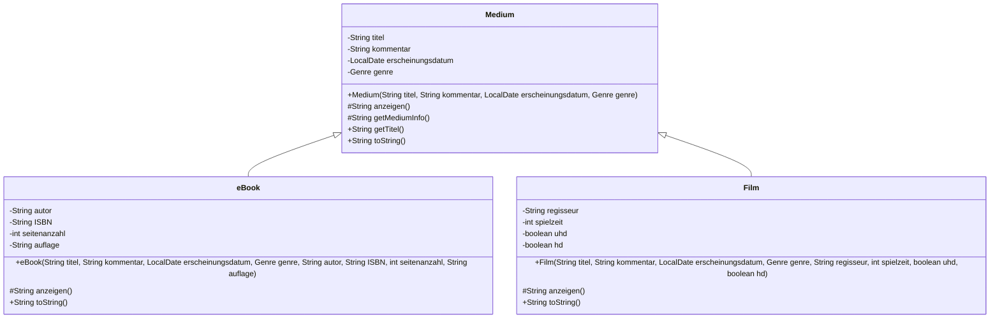

# Allgemeine Dokumentation

## Inhalte
### Klassen:
1. eBook
2. Film
3. Genre
4. Kommandozeilenmenue
5. Main
6. Medienbibliothek
7. Medium
8. Urheber

### Struktur

```mermaid
classDiagram
    class Medium {
        -String titel
        -String kommentar
        -LocalDate erscheinungsdatum
        -Genre genre
        +Medium(String titel, String kommentar, LocalDate erscheinungsdatum, Genre genre)
        #String anzeigen()
        #String getMediumInfo()
        +String getTitel()
        +String toString()
    }

    class eBook {
        -String autor
        -String ISBN
        -int seitenanzahl
        -String auflage
        +eBook(String titel, String kommentar, LocalDate erscheinungsdatum, Genre genre, String autor, String ISBN, int seitenanzahl, String auflage)
        #String anzeigen()
        +String toString()
    }

    class Film {
        -String regisseur
        -int spielzeit
        -boolean uhd
        -boolean hd
        +Film(String titel, String kommentar, LocalDate erscheinungsdatum, Genre genre, String regisseur, int spielzeit, boolean uhd, boolean hd)
        #String anzeigen()
        +String toString()
    }

    Medium <|-- eBook
    Medium <|-- Film

```

### 